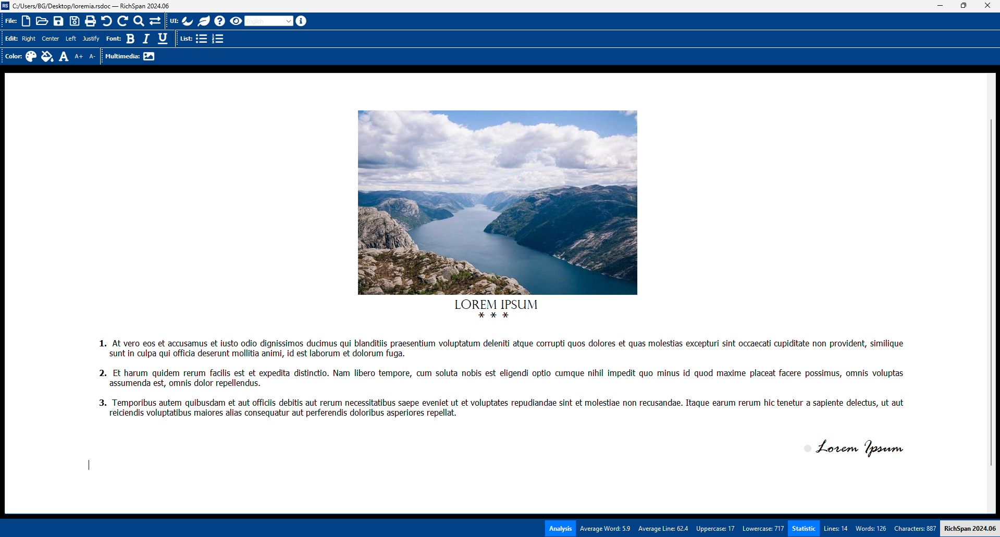

# RichSpan - A Lightweight Word Processor




RichSpan is a lightweight word processor designed as a simple alternative to traditional word processing software. It is written in Python with a graphical user interface based on PySide6, ensuring cross-platform compatibility across Windows, macOS, and Linux.

## Features

- [x] **Cross-Platform**: Compatible with Windows, macOS, and Linux.
- [x] **Statistics**: Provides statistical information about the document.
- [x] **Find & Replace**: Search and replace functionality within the document.
- [x] **Printing**: Allows print or exporting documents to PDF format.
- [x] **Document Operations**: Supports .txt, .html, .docx (partial) and .rsdoc (RichSpan Document) file formats.
- [x] **Text Formatting**: Customize text with color, background color, bold, italic, underline, alignment, font, font size, and font color.
- [x] **Undo and Redo**: Provides undo and redo functionalities for editing operations.
- [x] **User Experience**: Features drag and drop functionality, supports dark mode, and provides alerts for unsaved changes.
- [x] **Base64 Image Support**: Supports embedding images using Base64 encoding.
- [x] **Customizable Toolbar**: Allows customization of the user interface toolbar.
- [x] **Performance**: Fast and lightweight with threading support and hardware acceleration.
- [x] **Multilingual**: Available in English, Turkish, German, Spanish, Azerbaijani, Uzbek, Chinese, Arabic.
- [x] **Enumeration and Bullet List**: Includes support for creating numbered and bulleted lists.
- [x] **Adaptive Power Saver**: Optimized for power consumption. Hybrid ultra and standard power saving mode.

## Prerequisites

- Python 3.12+
- PySide6
- mammoth
- chardet
- psutil
- langdetect
- pyinstaller

## Installation

1. Clone the repository:

   ```bash
   git clone https://github.com/berkaygediz/RichSpan.git
   ```

2. Install requirements:

   ```bash
   pip install -r requirements.txt
   ```

3. Creating a executable file (Unsigned):

   ```bash
   pyinstaller --noconfirm --onefile --windowed --icon "richspan_icon.ico" --name "RichSpan" --clean --optimize "2" --add-data "richspan_icon.png;."  "RichSpan.py"
   ```

## Usage

Launch RichSpan from the command line:

```bash
python RichSpan.py
```

## Contributing

Contributions to the RichSpan project are welcomed. Please refer to [CONTRIBUTING.md](CONTRIBUTING.md) for details on how to contribute and our code of conduct.

## License

This project is licensed under GNU GPLv3, GNU LGPLv3, and Mozilla Public License Version 2.0.
