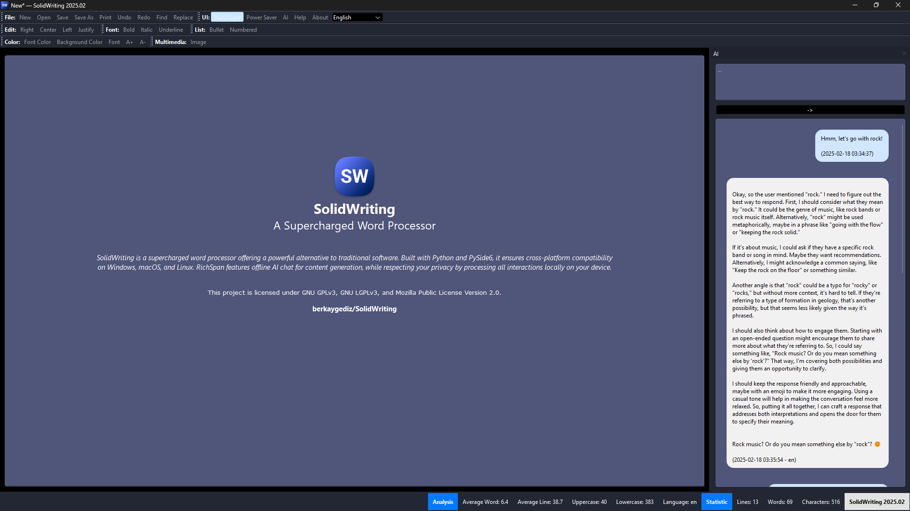

# SolidWriting

<p align="center">
    
</p>

<p align="center">
    <a href="https://github.com/berkaygediz/solidwriting/releases/latest">
        
    </a>
    <a href="https://github.com/berkaygediz/solidwriting">
        
    </a>
    <a href="https://github.com/berkaygediz/solidwriting">
        
    </a>
</p>

SolidWriting is a supercharged word processor offering a powerful alternative to traditional software. Built with Python and PySide6, it ensures cross-platform compatibility on Windows, macOS, and Linux. SolidWriting features offline AI chat for content generation, while respecting your privacy by processing all interactions locally on your device.

## Features

- [x] **Cross-Platform**: Fully compatible with Windows, macOS, and Linux.
- [x] **Document Statistics**: Provides key statistical information about the document.
- [x] **Find & Replace**: Search and replace text within your document.
- [x] **Printing & Exporting**: Print or export documents to PDF format.
- [x] **File Format Support**: Supports .txt, .html, .docx (partial), and .rsdoc (SolidWriting) file formats.
- [x] **Text Formatting**: Customize text with options like color, background color, bold, italic, underline, font style, size, and alignment.
- [x] **Undo & Redo**: Easily undo or redo any edits made in the document.
- [x] **User Experience**: Drag and drop functionality, dark mode support, and alerts for unsaved changes.
- [x] **Base64 Image Support**: Embed images in documents using Base64 encoding.
- [x] **Customizable Toolbar**: Personalize the user interface toolbar to suit your workflow.
- [x] **Performance**: Fast and lightweight with threading support and hardware acceleration.
- [x] **Multilingual Support**: Available in multiple languages including English, Deutsch, Español, Türkçe, Azərbaycanca, Uzbek, 中文 (Chinese), 한국어 (Korean), 日本語 (Japanese), العربية (Arabic), Русский (Russian), Français, Ελληνικά (Greek), Kinyarwanda (Rwandan) Hebrew (עברית).
- [x] **Lists**: Create numbered or bulleted lists.
- [x] **Adaptive Power Saving**: Optimized for power efficiency with hybrid ultra and standard power saving modes.
- [x] **Offline AI Chat**: Offline AI chat powered by a local language model, enabling direct interaction for questions and content generation, with automatic language detection, assisted by a context menu for enhanced user experience.

## Prerequisites

- Python 3.12+
- PySide6
- mammoth
- chardet
- psutil
- langdetect
- pyinstaller
- llama-cpp-python
- torch

## Installation

1. Clone the repository:

   ```bash
   git clone https://github.com/berkaygediz/SolidWriting.git
   ```

2. Install requirements:

   ```bash
   pip install -r requirements.txt
   ```

3. Creating a executable file (Unsigned):

   ```bash
   pyinstaller --name="SolidWriting" --nonconsole --onedir --windowed --icon=".\solidwriting_icon.ico" --add-data "./.venv/Lib/site-packages/PySide6/*:PySide6" --add-data "./.venv/Lib/site-packages/torch/*:torch" --add-data "./.venv/Lib/site-packages/llama_cpp/*:llama_cpp" --add-binary "./.venv/Lib/site-packages/PySide6/*:PySide6" --add-binary "./.venv/Lib/site-packages/torch/*:torch" --add-binary "./.venv/Lib/site-packages/llama_cpp/*:llama_cpp" --optimize "2" --clean --noconfirm ".\SolidWriting.py"
   ```

## Usage

Launch SolidWriting from the command line:

```bash
python SolidWriting.py
```

## Contributing

Contributions to the SolidWriting project are welcomed. Please refer to [CONTRIBUTING.md](CONTRIBUTING.md) for details on how to contribute and our code of conduct.

## License

This project is licensed under GNU GPLv3, GNU LGPLv3, and Mozilla Public License Version 2.0.
